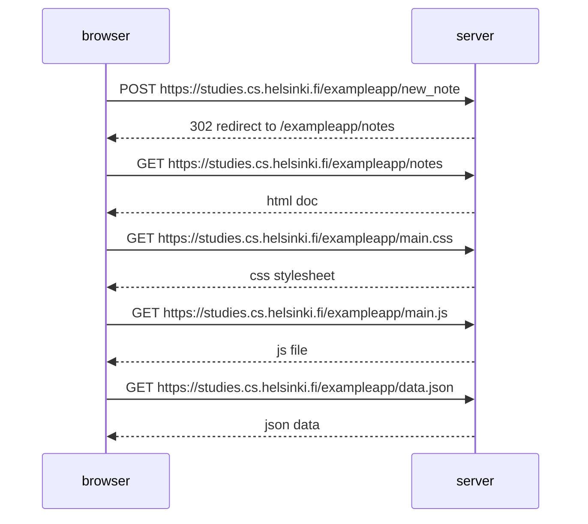

```mermaid
sequenceDiagram
    participant browser
    participant server

    browser->>server: POST https://studies.cs.helsinki.fi/exampleapp/new_note
    server-->>browser: 302 redirect to /exampleapp/notes

    browser->>server: GET https://studies.cs.helsinki.fi/exampleapp/notes
    server-->>browser: html doc

    browser->>server: GET https://studies.cs.helsinki.fi/exampleapp/main.css
    server-->>browser: css stylesheet

    browser->>server: GET https://studies.cs.helsinki.fi/exampleapp/main.js
    server-->>browser: js file

    browser->>server: GET https://studies.cs.helsinki.fi/exampleapp/data.json
    server-->>browser: json data
```